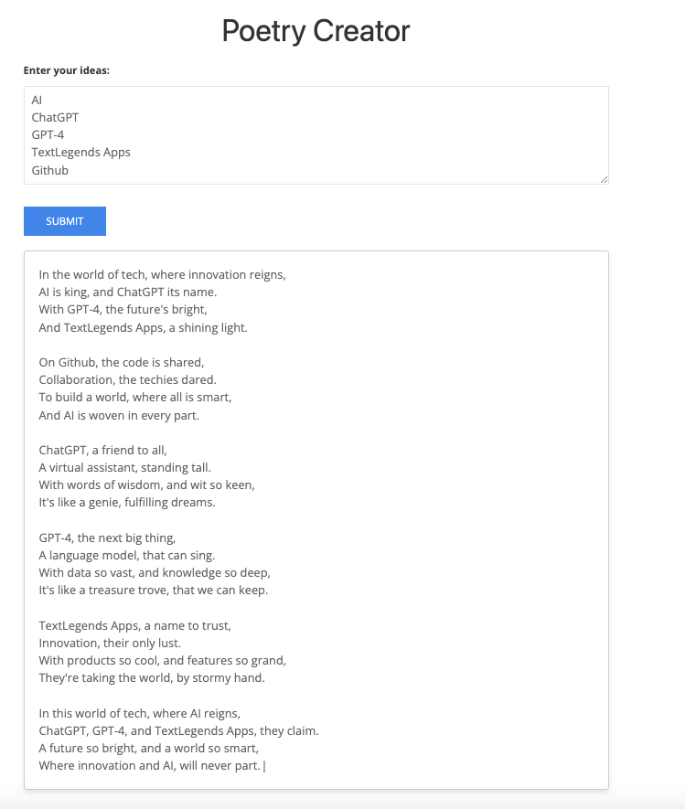

# Poetry Creator

A simple web app that allows users to enter their ideas and generates a poem based on those ideas. The poem is typed out using a typewriter effect. The app is built with HTML, CSS, JavaScript, jQuery, and the TypewriterJS library.

## Demo

You can try the live demo of the app at [www.textlegends.com/poet/](https://www.textlegends.com/poet/).

## Features

- Responsive design
- Typewriter effect using TypewriterJS
- Users can input their ideas in a textarea
- Poem generation based on user input

## Installation

1. Copy the index.php and getcode.php to a web server that supports PHP7+

## Usage

Enter your ideas in the textarea and click the "Submit" button. The app will generate a poem based on your ideas and type it out using a typewriter effect.

## Contributing

Pull requests are welcome. For major changes, please open an issue first to discuss what you would like to change.

## License

[MIT](https://choosealicense.com/licenses/mit/)

# GPT-poet-web

PHP, HTML, and Javascript implementation of a Poetry Creation tool that utilizes the ChatGPT GPT-3.5-turbo or GPT-4 model

This code is fully functional and a demo can be found at https://www.textlegends.com/poet/

## Enter your API key in getcode.php

This code was adapted from my code improvement tool

Ryan Decker - 05/01/2023 5:30 AM 
